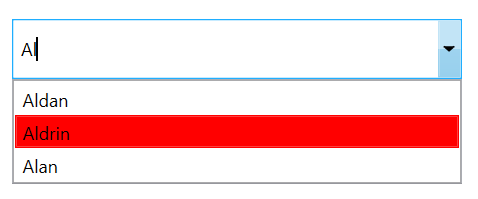

# Dropdown customization in WPF Autocomplete (SfTextBoxExt)

Suggestion box is the drop-down list box, which displays the filtered suggestions inside a pop-up. This section explains the properties and customizations that deals with drop-down list in the `AutoComplete` control.

## Customize the background 

The [DropDownBackground](https://help.syncfusion.com/cr/wpf/Syncfusion.Windows.Controls.Input.SfTextBoxExt.html#Syncfusion_Windows_Controls_Input_SfTextBoxExt_DropDownBackground) property is used to modify the background color of suggestion box. The following code example demonstrates how to change the background color of suggestion box.





<editors:SfTextBoxExt HorizontalAlignment="Center" 
                      VerticalAlignment="Center" 
                      Width="300"
                      Height="40"
                      SearchItemPath="Name"
                      AutoCompleteMode="Suggest"
                      DropDownBackground="AliceBlue"
                      AutoCompleteSource="{Binding Employees}" />




textBoxExt.DropDownBackground = new SolidColorBrush(Colors.AliceBlue);




## Drop-down placement 

The [SuggestionBoxPlacement](https://help.syncfusion.com/cr/wpf/Syncfusion.Windows.Controls.Input.SfTextBoxExt.html#Syncfusion_Windows_Controls_Input_SfTextBoxExt_SuggestionBoxPlacement) property, defines the position of pop-up relative to the control. It contains three built-in options:

1. Top
2. Bottom
3. None

The default value is bottom.

### Top

The drop-down list will open at the top of the text field.




<editors:SfTextBoxExt HorizontalAlignment="Center"
                      VerticalAlignment="Center"
                      Width="300"
                      Height="40"
                      SearchItemPath="Name"
                      SuggestionBoxPlacement="Top"
                      AutoCompleteMode="Suggest"
                      SuggestionMode="StartsWith"
                      AutoCompleteSource="{Binding Employees}"/>




textBoxExt.SuggestionBoxPlacement = SuggestionBoxPlacement.Top;




### Bottom

The drop-down list will open at the bottom of the text field.




<editors:SfTextBoxExt HorizontalAlignment="Center"
                      VerticalAlignment="Center"
                      Width="300"
                      Height="40"
                      SearchItemPath="Name"
                      SuggestionBoxPlacement="Bottom"
                      AutoCompleteMode="Suggest"
                      SuggestionMode="StartsWith"
                      AutoCompleteSource="{Binding Employees}"/>
  



textBoxExt.SuggestionBoxPlacement = SuggestionBoxPlacement.Bottom;




### None

The drop-down list will show the filtered items.




<editors:SfTextBoxExt HorizontalAlignment="Center"
                      VerticalAlignment="Center"
                      Width="300"
                      Height="40"
                      SearchItemPath="Name"
                      SuggestionBoxPlacement="None"
                      AutoCompleteMode="Suggest"
                      SuggestionMode="StartsWith"
                      AutoCompleteSource="{Binding Employees}"/>
    



textBoxExt.SuggestionBoxPlacement = SuggestionBoxPlacement.None;




## Setting the maximum height 

The maximum height of the suggestion box in the AutoComplete control can be changed using the [MaximumDropDownHeight](https://help.syncfusion.com/cr/wpf/Syncfusion.Windows.Controls.Input.SfTextBoxExt.html#Syncfusion_Windows_Controls_Input_SfTextBoxExt_MaxDropDownHeight) property.





<editors:SfTextBoxExt HorizontalAlignment="Center" 
                      VerticalAlignment="Center" 
                      Width="400"
                      SearchItemPath="Name"
                      MaxDropDownHeight="500"
                      AutoCompleteMode="Suggest"
                      AutoCompleteSource="{Binding Employees}"/>




textBoxExt.MaxDropDownHeight = 500;




## Open the drop-down on focus 

Suggestion box can be shown whenever the control receives focus using the [ShowSuggestionsOnFocus](https://help.syncfusion.com/cr/wpf/Syncfusion.Windows.Controls.Input.SfTextBoxExt.html#Syncfusion_Windows_Controls_Input_SfTextBoxExt_ShowSuggestionsOnFocus) property. At that time, suggestion list is the complete list of data source.





<editors:SfTextBoxExt HorizontalAlignment="Center" 
                      VerticalAlignment="Center" 
                      Width="400"
                      SearchItemPath="Name"
                      ShowSuggestionsOnFocus="True"
                      AutoCompleteMode="Suggest"
                      AutoCompleteSource="{Binding Employees}"/>




textBoxExt.ShowSuggestionsOnFocus = true;




## Open drop-down with a delay 

The [PopupDelay](https://help.syncfusion.com/cr/wpf/Syncfusion.Windows.Controls.Input.SfTextBoxExt.html#Syncfusion_Windows_Controls_Input_SfTextBoxExt_PopupDelay) specifies the delay after, which the suggestion pop-up should open. 




<editors:SfTextBoxExt HorizontalAlignment="Center" 
                      VerticalAlignment="Center" 
                      Width="400"
                      SearchItemPath="Name"
                      PopupDelay="00:00:02"
                      AutoCompleteMode="Suggest"
                      AutoCompleteSource="{Binding Employees}"/>




textBoxExt.PopupDelay = new TimeSpan(00,00,02);




## Customizing the SelectedItem background

The [SelectionBackgroundColor](https://help.syncfusion.com/cr/wpf/Syncfusion.Windows.Controls.Input.SfTextBoxExt.html#Syncfusion_Windows_Controls_Input_SfTextBoxExt_SelectionBackgroundColor) property is used to set the background color of the selected item in the suggestion box.





        <editors:SfTextBoxExt
            Width="300"
            Height="40"
            HorizontalAlignment="Center"
            VerticalAlignment="Center"
            AutoCompleteMode="Suggest"
            AutoCompleteSource="{Binding Employees}"
            SearchItemPath="Name"
            SelectionBackgroundColor="Red"
            ShowDropDownButton="True" />




textBoxExt.SelectionBackgroundColor = new SolidColorBrush(Colors.Red);




N> View [sample](https://github.com/SyncfusionExamples/wpf-textboxext-examples/tree/master/Samples/Dropdown-customization) in GitHub
