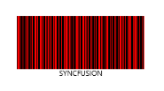

# Barcode Customization in WPF Barcode (SfBarcode)

The color of the barcode can be customized by modifying the DarkBarBrush and LightBarBrush properties of the barcode control. 



<sync:SfBarcode x:Name="barcode" Text="82698640929" DarkBarBrush=”Red” LightBarBrush="Blue” Symbology="QRBarcode"/>



The DarkBarBrush represents the color of the dark bar (Black color usually) and the LightBarBrush represents the color of the gap between two adjacent black bars (White color usually).

Barcode color combinations- Red
{:.caption}

Barcode color combinations- Blue
{:.caption}

N> The DarkBarBrush and LightBarBrush customizations are applicable only for one dimensional barcodes. In order for a barcode symbol to be recognized by a scanner, there must be an adequate contrast between the dark bars and the light spaces and not all the barcode scanners have support for colored barcodes.
