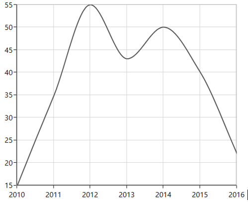
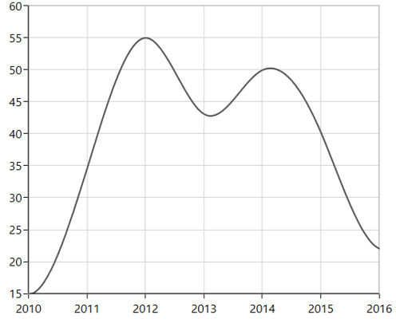

# Spline in WPF Charts (SfChart)

## Spline Chart

[`SplineSeries`](https://help.syncfusion.com/cr/wpf/Syncfusion.UI.Xaml.Charts.SplineSeries.html#) resembles line series, but the difference between them is that instead of connecting the data points with line segments, the data points are connected by smooth Bezier curves.





<chart:SplineSeries  XBindingPath="Year"     

ItemsSource="{Binding List}" YBindingPath="India"               

Interior="#4A4A4A"/>

<chart:SplineSeries  XBindingPath="Year"     

ItemsSource="{Binding List}" YBindingPath="America"               

Interior="#4A4A4A"/>





SplineSeries series1 = new SplineSeries()
{

    ItemsSource = new ViewModel().List,

    XBindingPath = "Year",

    YBindingPath = "India",

    Interior = new SolidColorBrush(Color.FromRgb(0x4A, 0x4A, 0x4A))

};

SplineSeries series2 = new SplineSeries()
{

    ItemsSource = new ViewModel().List,

    XBindingPath = "Year",

    YBindingPath = "America",

    Interior = new SolidColorBrush(Color.FromRgb(0x4A, 0x4A, 0x4A))

};

chart.Series.Add(series1);

chart.Series.Add(series2);





**Dashed Lines**

[`StrokeDashArray`](https://help.syncfusion.com/cr/wpf/Syncfusion.UI.Xaml.Charts.SplineSeries.html#Syncfusion_UI_Xaml_Charts_SplineSeries_StrokeDashArray) property of the [`SplineSeries`](https://help.syncfusion.com/cr/wpf/Syncfusion.UI.Xaml.Charts.SplineSeries.html#) is used to render spline series with dashes.





<chart:SplineSeries ItemsSource="{Binding List}" XBindingPath="Year" YBindingPath="India" StrokeDashArray="5,3" />





SplineSeries series = new SplineSeries()
{
    ItemsSource = new ViewModel().List,
    XBindingPath = "Year",
    YBindingPath = "India"
};

DoubleCollection doubleCollection = new DoubleCollection();
doubleCollection.Add(5);
doubleCollection.Add(3);
series.StrokeDashArray = doubleCollection;
chart.Series.Add(series);





N> You can explore our [WPF Spline Chart](https://www.syncfusion.com/wpf-controls/charts/wpf-spline-chart) feature tour page for its groundbreaking features. You can also explore our [WPF Spline Chart example](https://github.com/syncfusion/wpf-demos/blob/master/chart/Views/Basic%20Charts/Spline.xaml) to know how to displays multiple series of data as spline.

## Spline Area Chart

[`SplineAreaSeries`](https://help.syncfusion.com/cr/wpf/Syncfusion.UI.Xaml.Charts.SplineAreaSeries.html#) connects a series of data points using smooth Bezier line curves, with the underlying areas filled. 





<chart:SplineAreaSeries Interior="#7F7F7F"              

ItemsSource="{Binding Products}" XBindingPath="ProdName"     

YBindingPath="Price" />





SplineAreaSeries series = new SplineAreaSeries()
{

    ItemsSource = new ViewModel().Products,

    XBindingPath = "ProdName",

    YBindingPath = "Price",

    Interior = new SolidColorBrush(Color.FromRgb(0x7F, 0x7F, 0x7F))

};

chart.Series.Add(series);





N> You can explore our [WPF Spline Area Chart](https://www.syncfusion.com/wpf-controls/charts/wpf-spline-area-chart) feature tour page for its groundbreaking features. You can also explore our [WPF Spline Area Chart example](https://github.com/syncfusion/wpf-demos/blob/master/chart/Views/Basic%20Charts/SplineArea.xaml) to know how to displays multiple series of data as spline area.

## Spline Type

[`Spline`](https://help.syncfusion.com/cr/wpf/Syncfusion.UI.Xaml.Charts.SplineSeries.html) and [`SplineArea`](https://help.syncfusion.com/cr/wpf/Syncfusion.UI.Xaml.Charts.SplineAreaSeries.html) series provide support for various spline type. The spline type of the series can be changed by using its [`SplineType`](https://help.syncfusion.com/cr/wpf/Syncfusion.UI.Xaml.Charts.SplineSeries.html#Syncfusion_UI_Xaml_Charts_SplineSeries_SplineTypeProperty) property. The following spline types are supported by Spline and SplineArea series:

* [`Natural`](https://help.syncfusion.com/cr/wpf/Syncfusion.UI.Xaml.Charts.SplineType.html) 
* [`Monotonic`](https://help.syncfusion.com/cr/wpf/Syncfusion.UI.Xaml.Charts.SplineType.html) 
* [`Cardinal`](https://help.syncfusion.com/cr/wpf/Syncfusion.UI.Xaml.Charts.SplineType.html)
* [`Clamped`](https://help.syncfusion.com/cr/wpf/Syncfusion.UI.Xaml.Charts.SplineType.html)

**Cardinal**

The following code illustrates how to set the [`SplineType`](https://help.syncfusion.com/cr/wpf/Syncfusion.UI.Xaml.Charts.SplineSeries.html#Syncfusion_UI_Xaml_Charts_SplineSeries_SplineType) value as [`Cardinal`](https://help.syncfusion.com/cr/wpf/Syncfusion.UI.Xaml.Charts.SplineType.html).





<chart:SplineSeries SplineType="Cardinal">

</chart:SplineSeries>





SplineSeries series = new SplineSeries();

series.SplineType = SplineType.Cardinal;





**Monotonic**

The following code illustrates how to set the [`SplineType`](https://help.syncfusion.com/cr/wpf/Syncfusion.UI.Xaml.Charts.SplineSeries.html#Syncfusion_UI_Xaml_Charts_SplineSeries_SplineTypeProperty) value as Monotonic.





<chart:SplineSeries SplineType="Monotonic">

</chart:SplineSeries>





SplineSeries series = new SplineSeries();

series.SplineType = SplineType.Monotonic;





**Clamped**

The following code illustrates how to set the [`SplineType`](https://help.syncfusion.com/cr/wpf/Syncfusion.UI.Xaml.Charts.SplineSeries.html#Syncfusion_UI_Xaml_Charts_SplineSeries_SplineTypeProperty) value as Clamped.





<chart:SplineSeries SplineType="Clamped">

</chart:SplineSeries>





SplineSeries series = new SplineSeries();

series.SplineType = SplineType.Clamped;





