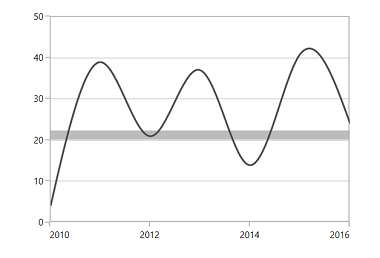
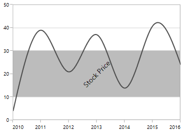
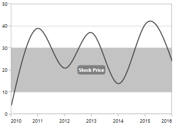
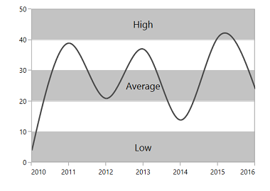
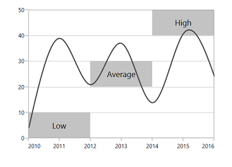
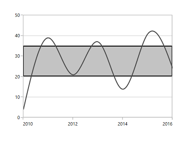
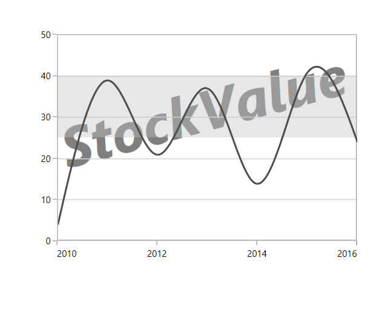

# Striplines in WPF Charts (SfChart)

SfChart allows you to add Striplines to the chart, which shades the specific region or range in the plot area background at regular or custom intervals. 

## Positioning the Striplines

SfChart provides [`Start`](https://help.syncfusion.com/cr/wpf/Syncfusion.UI.Xaml.Charts.ChartStripLine.html#Syncfusion_UI_Xaml_Charts_ChartStripLine_Start) and [`Width`](https://help.syncfusion.com/cr/wpf/Syncfusion.UI.Xaml.Charts.ChartStripLine.html#Syncfusion_UI_Xaml_Charts_ChartStripLine_Width) property for defining the Stripline start and end range. These values correspond to the axis values (or range). The Stripline can be filled using brush set in [`Background`](https://help.syncfusion.com/cr/wpf/Syncfusion.UI.Xaml.Charts.ChartStripLine.html#Syncfusion_UI_Xaml_Charts_ChartStripLine_Background) property.





<syncfusion:SfChart.SecondaryAxis>

<syncfusion:NumericalAxis >

<syncfusion:NumericalAxis.StripLines>

<syncfusion:ChartStripLine Start="20" Width="10"  Background="#BCBCBC"/>

</syncfusion:NumericalAxis.StripLines>

</syncfusion:NumericalAxis>

</syncfusion:SfChart.SecondaryAxis>





NumericalAxis axis = new NumericalAxis();

ChartStripLine stripline = new ChartStripLine()
{

    Start = 20, Width = 10,

    Background = new SolidColorBrush(Color.FromRgb(0xBC, 0xBC, 0xBC))

};

axis.StripLines.Add(stripline);

chart.SecondaryAxis = axis;





### Position based on device coordinates

You can specify the stripline width in pixel by enabling [`IsPixelWidth`](https://help.syncfusion.com/cr/wpf/Syncfusion.UI.Xaml.Charts.ChartStripLine.html#Syncfusion_UI_Xaml_Charts_ChartStripLine_IsPixelWidth) Boolean property. By default, this property value is false.

The following code example illustrates the positioning of stripline based on pixels.





<syncfusion:SfChart.SecondaryAxis>

<syncfusion:NumericalAxis >

<syncfusion:NumericalAxis.StripLines>

<syncfusion:ChartStripLine Start="20" Width="10"  

IsPixelWidth="True" Background="#BCBCBC"/>

</syncfusion:NumericalAxis.StripLines>

</syncfusion:NumericalAxis>

</syncfusion:SfChart.SecondaryAxis>





NumericalAxis axis = new NumericalAxis();

ChartStripLine stripline = new ChartStripLine()
{

    Start = 20, Width = 10,

    IsPixelWidth = true,

    Background = new SolidColorBrush(Color.FromRgb(0xBC, 0xBC, 0xBC))

};

axis.StripLines.Add(stripline);

chart.SecondaryAxis = axis;





## Label 

We can define any text inside the stripline using [`Label`](https://help.syncfusion.com/cr/wpf/Syncfusion.UI.Xaml.Charts.ChartStripLine.html#Syncfusion_UI_Xaml_Charts_ChartStripLine_Label) property. Also SfChart provides various customization options for this label like alignment, templates, etc.

The [`LabelHorizontalAlignment`](https://help.syncfusion.com/cr/wpf/Syncfusion.UI.Xaml.Charts.ChartStripLine.html#Syncfusion_UI_Xaml_Charts_ChartStripLine_LabelHorizontalAlignment) and [`LabelVerticalAlignment`](https://help.syncfusion.com/cr/wpf/Syncfusion.UI.Xaml.Charts.ChartStripLine.html#Syncfusion_UI_Xaml_Charts_ChartStripLine_LabelVerticalAlignment) property can be used for positioning the labels inside the stripline.





<syncfusion:SfChart.SecondaryAxis>

<syncfusion:NumericalAxis>              

<syncfusion:NumericalAxis.StripLines>

<syncfusion:ChartStripLine Start="10" Width="10"  

Label="Stock Price" 

LabelHorizontalAlignment="Center" 

LabelVerticalAlignment="Top"

Background="#BCBCBC"/>

</syncfusion:NumericalAxis.StripLines>

</syncfusion:NumericalAxis>

</syncfusion:SfChart.SecondaryAxis>





NumericalAxis axis = new NumericalAxis();

ChartStripLine stripline = new ChartStripLine()
{

    Start = 20, Width = 10,

    Label = "Stock Price",

    LabelHorizontalAlignment = HorizontalAlignment.Center,

    LabelVerticalAlignment = VerticalAlignment.Top,

    Background = new SolidColorBrush(Color.FromRgb(0xBC, 0xBC, 0xBC))

};

axis.StripLines.Add(stripline);

chart.SecondaryAxis = axis;





### Rotating the label

The label can be rotated to the specified angle using [`LabelAngle`](https://help.syncfusion.com/cr/wpf/Syncfusion.UI.Xaml.Charts.ChartStripLine.html#Syncfusion_UI_Xaml_Charts_ChartStripLine_LabelAngle) property. The following code example explains the rotation of stripline label:





<syncfusion:SfChart.SecondaryAxis>

<syncfusion:NumericalAxis>     

<syncfusion:NumericalAxis.StripLines>

<syncfusion:ChartStripLine Start="10" Width="20"  

Label="Stock Price" 

LabelAngle="-45"

Background="#BCBCBC"/>

</syncfusion:NumericalAxis.StripLines>

</syncfusion:NumericalAxis>

</syncfusion:SfChart.SecondaryAxis>





NumericalAxis axis = new NumericalAxis();

ChartStripLine stripline = new ChartStripLine()
{

    Start = 20, Width = 10,

    Label = "Stock Price",

    LabelAngle = -45,

    Background = new SolidColorBrush(Color.FromRgb(0xBC, 0xBC, 0xBC))

};

axis.StripLines.Add(stripline);

chart.SecondaryAxis = axis;





N> Here, Start and Width of the stripline as adjusted based on the rotation angle. Stripline won’t adjust its range based on the stripline angle.

### Template support for the label

[`LabelTemplate`](https://help.syncfusion.com/cr/wpf/Syncfusion.UI.Xaml.Charts.ChartStripLine.html#Syncfusion_UI_Xaml_Charts_ChartStripLine_LabelTemplate) property allows you to define the data template for the stripline label like the following code example.





 <syncfusion:SfChart x:Name="chart">

    <syncfusion:SfChart.Resources>

        <DataTemplate x:Key="labelTemplate">

                    <Border Background="Gray" CornerRadius="5" >

                        <TextBlock Text="{Binding }" Foreground="White" 
                                   
                                   FontStyle="Normal" FontSize="10" 
                                   
                                   FontWeight="Bold" Margin="3"/>

                    </Border>

        </DataTemplate>

    </syncfusion:SfChart.Resources>

    <syncfusion:SfChart.PrimaryAxis>

          <syncfusion:NumericalAxis>

                <syncfusion:NumericalAxis.StripLines>

                    <syncfusion:ChartStripLine Width="20" Start="10" 
                                                       
                                               Label="Stock Price" 
                                                       
                                                Background="#C3C3C3"
                                                       
                                                LabelTemplate="{StaticResource labelTemplate}"/>

                </syncfusion:NumericalAxis.StripLines>

            </syncfusion:NumericalAxis>

    </syncfusion:SfChart.PrimaryAxis>

</syncfusion:SfChart>
        




SfChart chart = new SfChart();

chart.PrimaryAxis = new NumericalAxis();

ChartStripLine stripline = new ChartStripLine()
{

    Width = 20,

    Start = 10,

    Label = "Stock Price",

    Background =new SolidColorBrush(Color.FromRgb(0xC3,0XC3,0XC3)),

    LabelTemplate = chart.Resources["labelTemplate"] as DataTemplate

};

chart.PrimaryAxis.StripLines.Add(stripline);





## Multiple Striplines

You can add multiple number of striplines in the same axis like the following code example,





<syncfusion:SfChart.SecondaryAxis>

<syncfusion:NumericalAxis >

<syncfusion:NumericalAxis.StripLines>

<syncfusion:ChartStripLine 

SegmentStartValue="0" 

Width="10" 

Start="0" Label="Low" Background="#C3C3C3"/>

<syncfusion:ChartStripLine 

Width="10" Start="20"

Label="Average" Background="#C3C3C3"/>

<syncfusion:ChartStripLine 

Width="10" 

Start="40" Label="High" Background="#C3C3C3"/>

</syncfusion:NumericalAxis.StripLines>

</syncfusion:NumericalAxis>

</syncfusion:SfChart.SecondaryAxis>





NumericalAxis axis = new NumericalAxis();

ChartStripLine stripline1 = new ChartStripLine()
{

    SegmentStartValue = 0, Start = 0,

    Width = 10, Label = "Low",

    Background = new SolidColorBrush(Color.FromRgb(0xC3, 0xC3, 0xC3))

};

ChartStripLine stripline2 = new ChartStripLine()
{

    Start = 20, Width = 10,

    Label = "Average",

    Background = new SolidColorBrush(Color.FromRgb(0xC3, 0xC3, 0xC3))

};

ChartStripLine stripline3 = new ChartStripLine()
{

    Start = 40,Width = 10,

    Label = "High",

    Background = new SolidColorBrush(Color.FromRgb(0xC3, 0xC3, 0xC3))

};

axis.StripLines.Add(stripline1);

axis.StripLines.Add(stripline2);

axis.StripLines.Add(stripline3);

chart.SecondaryAxis = axis;





If you want to repeat the same type of stripline at regular intervals, SfChart provides two properties[`RepeatEvery`](https://help.syncfusion.com/cr/wpf/Syncfusion.UI.Xaml.Charts.ChartStripLine.html#Syncfusion_UI_Xaml_Charts_ChartStripLine_RepeatEvery) and [`RepeatUntil`](https://help.syncfusion.com/cr/wpf/Syncfusion.UI.Xaml.Charts.ChartStripLine.html#Syncfusion_UI_Xaml_Charts_ChartStripLine_RepeatUntil).

N> This can be used to fill plot area background alternatively.





<syncfusion:NumericalAxis.StripLines>

<syncfusion:ChartStripLine RepeatEvery="20" RepeatUntil="50"

Width="10"  Start="0" Background="#C3C3C3"/>

<syncfusion:ChartStripLine RepeatEvery="20" RepeatUntil="50"

Width="10"  Start="10" Background="#A3A3A3"/>

</syncfusion:NumericalAxis.StripLines>





NumericalAxis axis = new NumericalAxis();

ChartStripLine stripline1 = new ChartStripLine()

{

    RepeatEvery = 20,

    RepeatUntil = 50,

    Start = 0, Width = 10,

    Background = new SolidColorBrush(Color.FromRgb(0xC3, 0xC3, 0xC3))

};

ChartStripLine stripline2 = new ChartStripLine()

{

    RepeatEvery = 20,

    RepeatUntil = 50,

    Start = 10, Width = 10,

    Background = new SolidColorBrush(Color.FromRgb(0xA3, 0xA3, 0xA3))

};

axis.StripLines.Add(stripline1);

axis.StripLines.Add(stripline2);

chart.SecondaryAxis = axis;





## Segmented Stripline

Striplines can also be placed in a particular region with respect to segment. You can enable the segment striplines using [`IsSegmented`](https://help.syncfusion.com/cr/wpf/Syncfusion.UI.Xaml.Charts.ChartStripLine.html#Syncfusion_UI_Xaml_Charts_ChartStripLine_IsSegmented) property.

So the start and end value of this type of striplines can be defined using [`SegmentStartValue`](https://help.syncfusion.com/cr/wpf/Syncfusion.UI.Xaml.Charts.ChartStripLine.html#Syncfusion_UI_Xaml_Charts_ChartStripLine_SegmentStartValue) and [`SegmentEndValue`](https://help.syncfusion.com/cr/wpf/Syncfusion.UI.Xaml.Charts.ChartStripLine.html#Syncfusion_UI_Xaml_Charts_ChartStripLine_SegmentEndValue) property.

The following code example demonstrates segmented striplines.





<syncfusion:SfChart.SecondaryAxis>

<syncfusion:NumericalAxis >

<syncfusion:NumericalAxis.StripLines>

<syncfusion:ChartStripLine 

IsSegmented="True" SegmentStartValue="0" 

Width="10" SegmentEndValue="2"                                               

SegmentAxisName="Segment1"  

Start="0" Label="Low" Background="#C3C3C3"/>

<syncfusion:ChartStripLine 

IsSegmented="True" SegmentStartValue="2"

SegmentAxisName="Segment2"  

Width="10" SegmentEndValue="4" Start="20"

Label="Average" Background="#C3C3C3"/>

<syncfusion:ChartStripLine 

IsSegmented="True" SegmentStartValue="4" 

Width="10" SegmentEndValue="6" 

SegmentAxisName="Segment3"  

Start="40" Label="High" Background="#C3C3C3"/>

</syncfusion:NumericalAxis.StripLines>

</syncfusion:NumericalAxis>

</syncfusion:SfChart.SecondaryAxis>





NumericalAxis axis = new NumericalAxis();

ChartStripLine stripline1 = new ChartStripLine()
{

    IsSegmented = true,

    SegmentStartValue = 0,

    SegmentEndValue = 2,

    SegmentAxisName = "Segment1",

    Start = 0, Width = 10,

    Label = "Low",

    Background = new SolidColorBrush(Color.FromRgb(0xC3, 0xC3, 0xC3))

};

ChartStripLine stripline2 = new ChartStripLine()
{
    IsSegmented = true,

    SegmentStartValue = 2,

    SegmentEndValue = 4,

    SegmentAxisName = "Segment2",

    Start = 20, Width = 10,

    Label = "Average",

    Background = new SolidColorBrush(Color.FromRgb(0xC3, 0xC3, 0xC3))
};

ChartStripLine stripline3 = new ChartStripLine()
{

    IsSegmented = true,

    SegmentStartValue = 4,

    SegmentEndValue = 6,

    SegmentAxisName = "Segment3",

    Start = 40, Width = 10,

    Label = "High",

    Background = new SolidColorBrush(Color.FromRgb(0xC3, 0xC3, 0xC3))

};

axis.StripLines.Add(stripline1);

axis.StripLines.Add(stripline2);

axis.StripLines.Add(stripline3);

chart.SecondaryAxis = axis;





## Customization

The background, border brush and border thickness of the stripline can be modified using [`Background`](https://help.syncfusion.com/cr/wpf/Syncfusion.UI.Xaml.Charts.ChartStripLine.html#Syncfusion_UI_Xaml_Charts_ChartStripLine_Background), [`BorderBrush`](https://help.syncfusion.com/cr/wpf/Syncfusion.UI.Xaml.Charts.ChartStripLine.html#Syncfusion_UI_Xaml_Charts_ChartStripLine_BorderBrush) and [`BorderThickness`](https://help.syncfusion.com/cr/wpf/Syncfusion.UI.Xaml.Charts.ChartStripLine.html#Syncfusion_UI_Xaml_Charts_ChartStripLine_BorderThickness) properties  as in the following code example.





<syncfusion:SfChart.SecondaryAxis>

<syncfusion:NumericalAxis >

<syncfusion:NumericalAxis.StripLines>

<syncfusion:ChartStripLine Start="20" Width="15"   

BorderBrush="Black" 

BorderThickness="2"

Background="#C3C3C3"/>

</syncfusion:NumericalAxis.StripLines>

</syncfusion:NumericalAxis>

</syncfusion:SfChart.SecondaryAxis>





NumericalAxis axis = new NumericalAxis();

ChartStripLine stripline = new ChartStripLine()  

{

    Start = 20, Width = 15,

    BorderThickness = new Thickness(2),

    BorderBrush = new SolidColorBrush(Colors.Black),

    Background = new SolidColorBrush(Color.FromRgb(0xC3, 0xC3, 0xC3))

};

axis.StripLines.Add(stripline);

chart.SecondaryAxis = axis;





### Transparency 

You can set the transparency for the striplines using `Opacity` property as in the following code snippets.





<syncfusion:SfChart.SecondaryAxis>

<syncfusion:NumericalAxis >

<syncfusion:NumericalAxis.StripLines>

<syncfusion:ChartStripLine Start="25" Width="15" 

Opacity="0.4" Background="#C3C3C3"/>

</syncfusion:NumericalAxis.StripLines>

</syncfusion:NumericalAxis>

</syncfusion:SfChart.SecondaryAxis>

<syncfusion:SfChart.Watermark>

<syncfusion:Watermark >

<syncfusion:Watermark.Content>

<TextBlock Text="StockValue">

<TextBlock.RenderTransform>

<RotateTransform Angle="345"/>

</TextBlock.RenderTransform>                        

</TextBlock>

</syncfusion:Watermark.Content>

</syncfusion:SfChart.Watermark>





NumericalAxis axis = new NumericalAxis();

ChartStripLine stripline = new ChartStripLine()
{

    Start = 25,Width = 15,

    Opacity = 0.4,

    Background = new SolidColorBrush(Color.FromRgb(0xC3, 0xC3, 0xC3))

};

axis.StripLines.Add(stripline);

chart.SecondaryAxis = axis;

chart.Watermark = new Watermark()
{

    HorizontalAlignment = HorizontalAlignment.Center,

    VerticalAlignment = VerticalAlignment.Center

};

TextBlock textBlock = new TextBlock();

textBlock.Text = "StockValue";

textBlock.FontSize = 70;

textBlock.RenderTransform = new RotateTransform() { Angle = 345 };

chart.Watermark.Content = textBlock;





## See also

[`How to display striplines in DateTimeAxis of WPF Chart`](https://www.syncfusion.com/kb/10674/how-to-display-striplines-in-datetimeaxis-of-wpf-chart)
