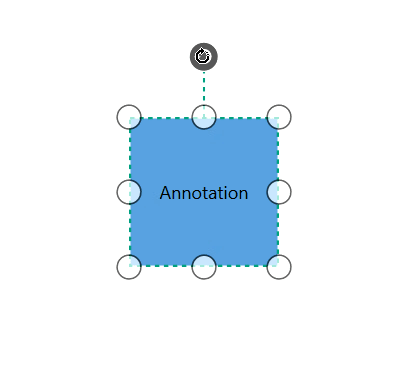
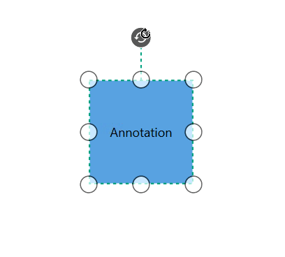

# How to Rotate the Annotation

Rotation process can be applied over annotation and rotation can be controlled by annotation and its parent node or connector.
To learn about annotation constraints, refer to the [Annotation Constraints](https://help.syncfusion.com/cr/wpf/Syncfusion.UI.Xaml.Diagram.AnnotationConstraints.html).

## Rotating the annotation

Rotation of annotation can be enabled by using the `Constraints` property of `AnnotationEditorViewModel` class and setting its value as `AnnotationConstraints.Rotatable`.




<!--Initialize the AnnotationCollection-->
<syncfusion:AnnotationCollection>
    <!--Initialize the annotation with rotatable constraint-->
    <syncfusion:AnnotationEditorViewModel Content="Annotation" Constraints="Selectable,Rotatable"/>
</syncfusion:AnnotationCollection>
                                



//Initialize the AnnotationCollection
Annotations = new ObservableCollection<IAnnotation>()
{
    new AnnotationEditorViewModel()
    {
        Content = "Annotation",
        //Initialize the constraint as rotatable
        Constraints = AnnotationConstraints.Selectable | AnnotationConstraints.Rotatable
    }
}




## How to customize the annotation rotation

 The `RotationReference` property of the annotation is to define the rotation based on Page or its host node or connector.To learn about the Rotate Reference property, refer to the [RotationReference](https://help.syncfusion.com/cr/wpf/Syncfusion.UI.Xaml.Diagram.RotationReference.html) . 




<!--Initialize the AnnotationCollection-->
<syncfusion:AnnotationCollection>
    <!--Initialize the annotation with rotation reference property-->
    <syncfusion:AnnotationEditorViewModel Content="Annotation" RotationReference="Parent"/>
</syncfusion:AnnotationCollection>
                                



//Initialize the Annotation Collection
Annotations = new ObservableCollection<IAnnotation>()
{
    new AnnotationEditorViewModel()
    {
        Content = "Annotation",
        //Initialize the rotation reference property
        RotationReference = RotationReference.Parent,
    }
}




| Values | Description | Node |
|---|---|---|---|
| Page | While rotating the node, annotation will not be rotated. |  |
| Wrap | While rotating the node, annotation will also be rotated with node. |  |

