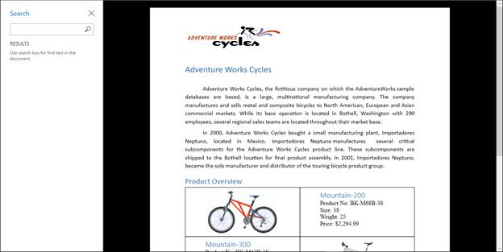

# Find and Replace in WPF RichTextBox (SfRichTextBoxAdv)

The SfRichTextBoxAdv control supports searching text contents in the document. This when used in combination with selection becomes a powerful tool enabling scenarios like highlighting specific parts of the document, applying formatting such as bold or replacing text. You can extend your search by using regular expression to find particular pattern of text in the document. 
The following code example explains how to find the first occurrence of a particular text in the document and apply bold formatting.


// Finds the first occurrence of specified text that matches case in RichTextBoxAdv document from current selection.
TextSearchResult textSearchResult = richTextBoxAdv.Find("Panda", FindOptions.CaseSensitive);

// Selects the text search result.
richTextBoxAdv.Selection.Select(textSearchResult.Start, textSearchResult.End);

// Applies Bold formatting for the current selection.
richTextBoxAdv.Selection.CharacterFormat.Bold = true;



' Finds the first occurrence of specified text that matches case in RichTextBoxAdv document from current selection.
Dim textSearchResult As TextSearchResult = richTextBoxAdv.Find("Panda", FindOptions.CaseSensitive)

' Selects the text search result.
richTextBoxAdv.Selection.[Select](textSearchResult.Start, textSearchResult.[End])

' Applies Bold formatting for the current selection.
richTextBoxAdv.Selection.CharacterFormat.Bold = True





The following code example demonstrates how to find all occurrences of a particular pattern of text in the document and highlighting the result.


// Finds all the words that starts with ‘S’ in RichTextBoxAdv document.
TextSearchResults textSearchResults = richTextBoxAdv.FindAll(new Regex(@"\bS\S*"), FindOptions.None);

// If any text search results found.
if (textSearchResults != null)
{
    for (int j = 0; j < textSearchResults.Count; j++)
    {
    
        TextSearchResult textSearchResult = textSearchResults[j];

        // Adds the search result text positions to the selection.
        richTextBoxAdv.Selection.SelectionRanges.Add(textSearchResult.Start, textSearchResult.End);
    }
    
// Apply highlight color for the selection.
    richTextBoxAdv.Selection.CharacterFormat.HighlightColor = HighlightColor.Yellow;
}



' Finds all the words that starts with ‘S’ in RichTextBoxAdv document.
Dim textSearchResults As TextSearchResults = richTextBoxAdv.FindAll(New Regex("\bS\S*"), FindOptions.None)

' If any text search results found.
If textSearchResults IsNot Nothing Then
	For j As Integer = 0 To textSearchResults.Count - 1

		Dim textSearchResult As TextSearchResult = textSearchResults(j)

		' Adds the search result text positions to the selection.
		richTextBoxAdv.Selection.SelectionRanges.Add(textSearchResult.Start, textSearchResult.[End])
	Next

	' Apply highlight color for the selection.
	richTextBoxAdv.Selection.CharacterFormat.HighlightColor = HighlightColor.Yellow
End If





## Replacing existing text

You can replace a single occurrence or all occurrences of a particular text or pattern of text in a document with another text by performing search operation. This helps you to modify the contents easily.
The following code example demonstrates how to replace a single occurrence of a text with another text in SfRichTextBoxAdv.


// Finds the text "colour" that matches whole word in the document.
TextSearchResult textSearchResult = richTextBoxAdv.Find("colour", FindOptions.WholeWord);

// If any text search result found, replace it with the text "color".
if (textSearchResult != null)
    textSearchResult.Replace("color");



' Finds the text "colour" that matches whole word in the document.
Dim textSearchResult As TextSearchResult = richTextBoxAdv.Find("colour", FindOptions.WholeWord)

' If any text search result found, replace it with the text "color".
If textSearchResult IsNot Nothing Then
	textSearchResult.Replace("color")
End If





The following code example demonstrates how to replace all occurrences of a particular text with another text in SfRichTextBoxAdv.


// Finds the text "analyse" that matches whole word in the document.
TextSearchResults textSearchResults = richTextBoxAdv.FindAll("analyse", FindOptions.WholeWord);

// If any text search results found, replace all occurrences with the text "analyze".
if(textSearchResults != null)
    textSearchResults.ReplaceAll("analyze");



' Finds the text "analyse" that matches whole word in the document.
Dim textSearchResults As TextSearchResults = richTextBoxAdv.FindAll("analyse", FindOptions.WholeWord)

' If any text search results found, replace all occurrences with the text "analyze".
If textSearchResults IsNot Nothing Then
	textSearchResults.ReplaceAll("analyze")
End If





## Options Pane

The SfRichTextBoxAdv provides the built-in options pane support to find the text and navigate to text results similar to Microsoft Word application.
The following code example demonstrates how to show the options pane in SfRichTextBoxAdv through command binding.


<!-- Binding Button to UI Command that shows the options pane  -->
<Button Content="Show Options Pane" Command="RichTextBoxAdv:SfRichTextBoxAdv.ShowOptionsPaneCommand" CommandTarget="{Binding ElementName=richTextBoxAdv}" />





N> You can refer to our [WPF RichTextBox](https://www.syncfusion.com/wpf-controls/richtextbox) feature tour page for its groundbreaking feature representations.You can also explore our [WPF RichTextBox example](https://github.com/syncfusion/wpf-demos/tree/master/richtextbox) to knows how to render and configure the editing tools.