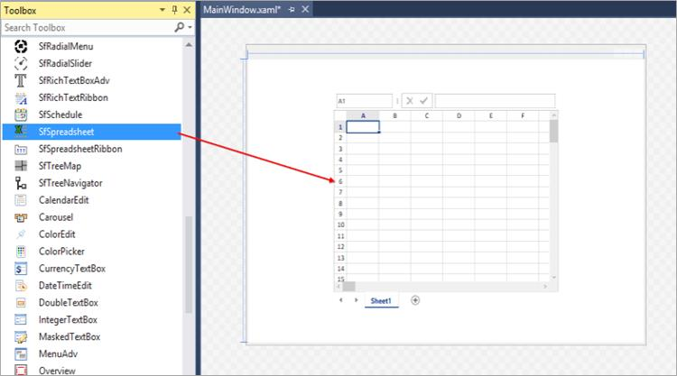
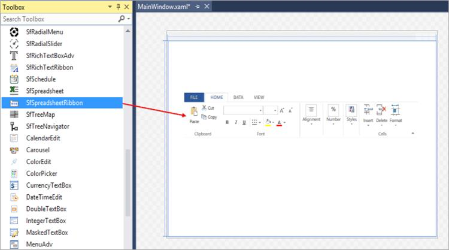
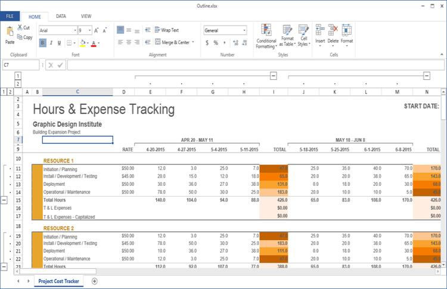

# Getting Started with WPF Spreadsheet (SfSpreadsheet)
This section helps you to get started with the SfSpreadsheet

## Assemblies Deployment
Below table describes, list of assemblies required to be added in project when the SfSpreadsheet control is used in your application.

<table>
<tr>
<th>
Assembly</th><th>
Description</th></tr>
<tr>
<td>
Syncfusion.SfCellGrid.WPF.dll</td><td>
Contains the base and fundamental classes which holds the underlying architecture for displaying cells with virtualized behavior and selection/interaction of cells.</td></tr>
<tr>
<td>
Syncfusion.SfGridCommon.WPF.dll</td><td>
Contains the classes which holds the properties and functions of scroll viewer and disposable elements</td></tr>
<tr>
<td>
Syncfusion.SfSpreadsheet.WPF.dll</td><td>
Contains the classes  that handles all the UI Operations of SfSpreadsheet such as importing of sheets, applying formulas/styles etc.</td></tr>
<tr>
<td>
Syncfusion.Shared.WPF.dll</td><td>
Contains the classes which holds the controls like Color pickers,Chromeless window, ComboBoxAdv, DateTimeEdit etc.</td></tr>
<tr>
<td>
Syncfusion.Tools.WPF.dll</td><td>
Contains the classes which holds the controls like TabControlExt, TabItemExt, Gallery, GroupBar, TabSplitter etc which are used in SfSpreadsheet</td></tr>
<tr>
<td>
Syncfusion.XlsIO.Base.dll</td><td>
Contains the base classes which is responsible for read and write in Excel files, Worksheet Manipulations, Formula calculations etc.</td></tr>
</table>

Below are the assemblies list that can be added when you want to enable certain features in SfSpreadsheet control. 

<table>
<tr>
<th>
Optional Assemblies</th><th>
Description</th></tr>
<tr>
<td>
Syncfusion.SfSpreadsheetHelper.WPF.dll</td><td>
Contains the classes which is responsible for importing charts and sparklines into SfSpreadsheet.</td></tr>
<tr>
<td>
Syncfusion.ExcelChartToImageConverter.WPF.dll</td><td>
Contains the classes which is responsible for converting charts as image.</td></tr>
<tr>
<td>
Syncfusion.SfChart.WPF.dll</td><td>
Contains the classes which is responsible for importing charts like Line charts, Pie charts, Sparklines etc.</td></tr>
<tr>
<td>
Syncfusion.ExcelToPDFConverter.Base.dll</td><td>
Contains the base and fundamental classes which is responsible for converting excel to PDF.</td></tr>
<tr>
<td>
Syncfusion.Pdf.Base.dll</td><td>
Contains the base and fundamental classes for creating PDF.</td></tr>
</table>

## Create a Simple Application with Spreadsheet

SfSpreadsheet control can be added into the application either via designer or via coding. 

### Adding a Control via Designer

1.Create new WPF application in Visual Studio.

2.Open the Visual Studio **Tool** **box**. Navigate to “Syncfusion Controls” tab, and find the  SfSpreadsheet/SfSpreadsheetRibbon toolbox items 

Syncfusion Control tab
   {:.caption}

3.Drag `SfSpreadsheet` and drop in the Designer area from the Toolbox

_For_ _Spreadsheet_



<syncfusion:SfSpreadsheet x:Name = spreadsheet />



4.Ribbon can be added to the application by dragging `SfSpreadsheetRibbon` to the Designer area.

5.To make an interaction between Ribbon items and `SfSpreadsheet`, bind the `SfSpreadsheet` as DataContext to the `SfSpreadsheetRibbon`.

_For_ _Ribbon_



<syncfusion:SfSpreadsheetRibbon DataContext= "{Binding ElementName=spreadsheet}"  />



### Adding Control via Coding

Spreadsheet is available in the following namespace “_Syncfusion_._UI_._Xaml_._Spreadsheet_” and it can be created programmatically either by using XAML or C# code. 

_For_ _Spreadsheet_



<Window x:Class="SpreadsheetDemo.MainWindow"
xmlns="http://schemas.microsoft.com/winfx/2006/xaml/presentation"
xmlns:x="http://schemas.microsoft.com/winfx/2006/xaml"
xmlns:d="http://schemas.microsoft.com/expression/blend/2008"
xmlns:mc="http://schemas.openxmlformats.org/markup- compatibility/2006"
xmlns:syncfusion="http://schemas.syncfusion.com/wpf"
syncfusion:SkinStorage.VisualStyle="Office2013"
mc:Ignorable="d">
<syncfusion:SfSpreadsheet x:Name="spreadsheet" FormulaBarVisibility="Visible"/>
</Window>


SfSpreadsheet spreadsheet = new SfSpreadsheet();
this.grid.Children.Add(spreadsheet);



N> To add the `SfSpreadsheetRibbon` in your application, use the `RibbonWindow` since the backstage of Ribbon will be opened only when the ribbon is loaded under the `RibbonWindow`



<syncfusion:RibbonWindow x:Class="SpreadsheetDemo.MainWindow"
xmlns="http://schemas.microsoft.com/winfx/2006/xaml/presentation"
xmlns:x="http://schemas.microsoft.com/winfx/2006/xaml"
xmlns:d="http://schemas.microsoft.com/expression/blend/2008"
xmlns:mc="http://schemas.openxmlformats.org/markup-compatibility/2006"
xmlns:syncfusion="http://schemas.syncfusion.com/wpf"
syncfusion:SkinStorage.VisualStyle="Office2013"
mc:Ignorable="d">
</syncfusion:RibbonWindow>



_You_ _can_ _get_ _the_ _following_ _output_ _when_ _execute_ _the_ _application_.

## Creating a new Excel Workbook

A new workbook can be created by using a [Create](https://help.syncfusion.com/cr/wpf/Syncfusion.UI.Xaml.Spreadsheet.SfSpreadsheet.html#Syncfusion_UI_Xaml_Spreadsheet_SfSpreadsheet_Create_System_Int32_) method with specified number of worksheets. By default, a workbook will be created with single worksheet.



spreadsheet.Create(2);



## Opening an existing Excel Workbook

The Excel Workbook can be opened in SfSpreadsheet using the [Open](https://help.syncfusion.com/cr/wpf/Syncfusion.UI.Xaml.Spreadsheet.SfSpreadsheet.html#Syncfusion_UI_Xaml_Spreadsheet_SfSpreadsheet_Open_Syncfusion_XlsIO_IWorkbook_) method in various ways,



//Using Stream,
spreadsheet.Open (Stream file);

//Using String,
spreadsheet.Open (string file);

//Using Workbook,
spreadsheet.Open(IWorkbook workbook);





spreadsheet.Open (@"..\..\Data\Outline.xlsx");



Opening Excel File in SfSpreadsheet
   {:.caption}

## Saving the Excel Workbook

The Excel workbook can be saved in SfSpreadsheet using [Save](https://help.syncfusion.com/cr/wpf/Syncfusion.UI.Xaml.Spreadsheet.SfSpreadsheet.html#Syncfusion_UI_Xaml_Spreadsheet_SfSpreadsheet_Save) method. If the workbook already exists in the system drive, it will be saved in the same location, otherwise Save Dialog box opens to save the workbook in user specified location. 



spreadsheet.Save();



You can also use [SaveAs](https://help.syncfusion.com/cr/wpf/Syncfusion.UI.Xaml.Spreadsheet.SfSpreadsheet.html#Syncfusion_UI_Xaml_Spreadsheet_SfSpreadsheet_SaveAs) method directly to save the existing excel file with modifications.

The `SaveAs` method in SfSpreadsheet can be used in various ways,



//Using Stream,
spreadsheet.SaveAs (Stream file);

//Using String,
spreadsheet.SaveAs (string file);

//For Dialog box,
spreadsheet.SaveAs();



## Displaying Charts and Sparklines

For importing charts and sparklines in SfSpreadsheet, add the following assembly as reference into the application.
 
Assembly: **Syncfusion.SfSpreadsheetHelper.WPF.dll**  

### Charts
 
Create an instance of Syncfusion.UI.Xaml.SpreadsheetHelper.[GraphicChartCellRenderer](https://help.syncfusion.com/cr/wpf/Syncfusion.UI.Xaml.SpreadsheetHelper.GraphicChartCellRenderer.html) and add that renderer into [GraphicCellRenderers](https://help.syncfusion.com/cr/wpf/Syncfusion.UI.Xaml.Spreadsheet.GraphicCells.GraphicModel.html#Syncfusion_UI_Xaml_Spreadsheet_GraphicCells_GraphicModel_GraphicCellRenderers) collection by using the helper method [AddGraphicChartCellRenderer](https://help.syncfusion.com/cr/wpf/Syncfusion.UI.Xaml.Spreadsheet.GraphicCells.GraphicCellHelper.html#Syncfusion_UI_Xaml_Spreadsheet_GraphicCells_GraphicCellHelper_AddGraphicChartCellRenderer_Syncfusion_UI_Xaml_Spreadsheet_SfSpreadsheet_Syncfusion_UI_Xaml_Spreadsheet_GraphicCells_IGraphicCellRenderer_) which is available under the namespace `Syncfusion.UI.Xaml.Spreadsheet.GraphicCells`. 



public MainWindow()
{
  InitializeComponent();
  
  //For importing charts,
  this.spreadsheet.AddGraphicChartCellRenderer(new GraphicChartCellRenderer());
}



### Sparklines

Create an instance of Syncfusion.UI.Xaml.SpreadsheetHelper.[SparklineCellRenderer](https://help.syncfusion.com/cr/wpf/Syncfusion.UI.Xaml.SpreadsheetHelper.SparklineCellRenderer.html) and add that renderer into the Spreadsheet by using the helper method [AddSparklineCellRenderer](https://help.syncfusion.com/cr/wpf/Syncfusion.UI.Xaml.Spreadsheet.GraphicCells.GraphicCellHelper.html#Syncfusion_UI_Xaml_Spreadsheet_GraphicCells_GraphicCellHelper_AddSparklineCellRenderer_Syncfusion_UI_Xaml_Spreadsheet_SfSpreadsheet_Syncfusion_UI_Xaml_Spreadsheet_CellRenderer_ISpreadsheetCellRenderer_) which is available under the namespace `Syncfusion.UI.Xaml.Spreadsheet.GraphicCells`.



public MainWindow()
{
  InitializeComponent();
      
  //For importing sparklines,
  this.spreadsheet.AddSparklineCellRenderer(new SparklineCellRenderer());
}



N> You can refer to our [WPF Spreadsheet](https://www.syncfusion.com/wpf-controls/spreadsheet) feature tour page for its groundbreaking feature representations. You can also explore our [WPF Spreadsheet example](https://github.com/syncfusion/wpf-demos) to know how to render and configure the spreadsheet.