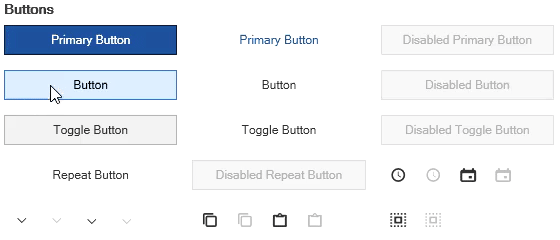

# Getting Started with Keyboard Focus Visual for WPF Controls

The [WPF Skin Manager](https://help.syncfusion.com/cr/wpf/Syncfusion.SfSkinManager.SfSkinManager.html) helps to apply various keyboard focus visual styles for both syncfusion and framework controls using [FocusVisualKind](https://help.syncfusion.com/cr/wpf/Syncfusion.SfSkinManager.Theme.html#Syncfusion_SfSkinManager_Theme_FocusVisualKind) property. 

The [FocusVisualKind](https://help.syncfusion.com/cr/wpf/Syncfusion.SfSkinManager.FocusVisualKind.html) enum has below values,

* `Default` - The default keyboard focus visual style will be applied.
* `HighVisibility` - High visibility keyboard visual feedback is an effect that shows a border for focusable elements when user moves keyboard focus to that element. 

N> The `HighVisibility` keyboard focus visual is enabled by default in fluent theme. 





public partial class MainWindow : ChromelessWindow
{
    public MainWindow()
    {
        SfSkinManager.SetTheme(this, new Theme() { ThemeName = "MaterialDark", FocusVisualKind = FocusVisualKind.HighVisibility });
        InitializeComponent();            
    }        
}





N> [View sample in GitHub](https://github.com/SyncfusionExamples/change-focusvisualkind-using-skinmanager).

