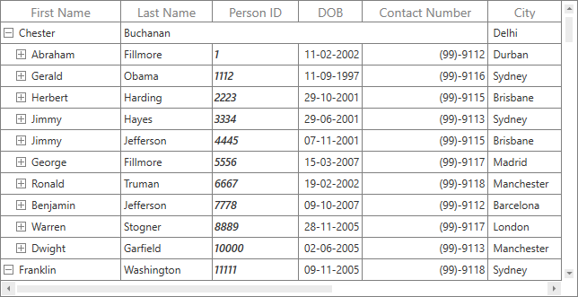
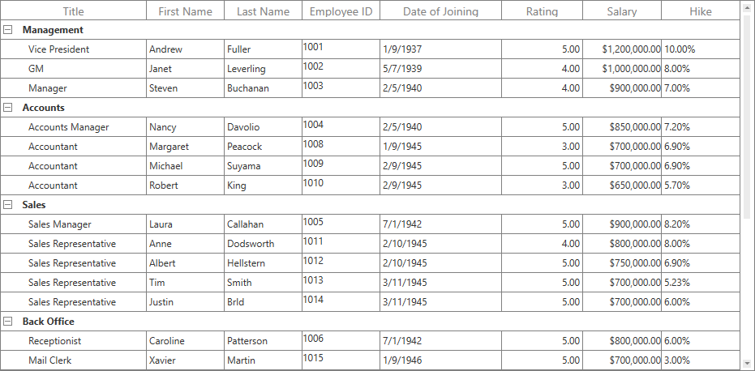

# Merge Cells in WPF TreeGrid (SfTreeGrid)

SfTreeGrid allows you to merge a range of adjacent cells in a row across columns using the [QueryCoveredRange](https://help.syncfusion.com/cr/wpf/Syncfusion.UI.Xaml.TreeGrid.SfTreeGrid.html) event.

The `QueryCoveredRange` event occurs when each cell is arranged. When scrolling, the merged range will be added for newly added columns through this event and will also be removed for the columns that are out of view.

[TreeGridQueryCoveredRangeEventArgs](https://help.syncfusion.com/cr/wpf/Syncfusion.UI.Xaml.TreeGrid.TreeGridQueryCoveredRangeEventArgs.html) of the `QueryCoveredRange` event provides information about the cell triggered in this event. GridQueryCoveredRangeEventArgs.OriginalSender returns the TreeGrid fired in this event using the TreeGridQueryCoveredRangeEventArgs.Range property. The adjacent cells can be merged.




<syncfusion:SfTreeGrid Name="treeGrid"
                                ItemsSource="{Binding EmployeeDetails}"
                                QueryCoveredRange="treeGrid_QueryCoveredRange"
                                SelectionMode="Single"
                                NavigationMode="Cell">
							



treeGrid.QueryCoveredRange += TreeGrid_QueryCoveredRange;
treeGrid.SelectionMode = Syncfusion.UI.Xaml.Grid.GridSelectionMode.Single;
treeGrid.NavigationMode = Syncfusion.UI.Xaml.Grid.NavigationMode.Cell;

void TreeGrid_QueryCoveredRange(object sender, TreeGridQueryCoveredRangeEventArgs e)
{
           
}
	



## Column wise merging cells by fixed range

You can merge the columns by setting the range using the Left and Right properties of `TreeGridCoveredCellInfo`.




void treeGrid_QueryCoveredRange(object sender, Syncfusion.UI.Xaml.TreeGrid.TreeGridQueryCoveredRangeEventArgs e)
{
    if (e.RowColumnIndex.RowIndex == 1)
    {

        if (e.RowColumnIndex.ColumnIndex >= 1 && e.RowColumnIndex.ColumnIndex <= 3)
        {
            e.Range = new TreeGridCoveredCellInfo(1, 4, 1);
            e.Handled = true;
        }
    }
}
	



## Merge all cells in an entire parent node

You can merge the entire column parent node using `TreeGridCoveredCellInfo`.




<syncfusion:SfTreeGrid Name="treeGrid"
                                ItemsSource="{Binding EmployeeDetails}"
                                QueryCoveredRange="treeGrid_QueryCoveredRange"
                                SelectionMode="Single"
                                NavigationMode="Cell">
							



public delegate void TreeGridRequestTreeItemsHandler(object sender, RoutedEventArgs args);

/// 

///  Handles the cell merging in SfTreeGrid.
/// 

public class QueryCoveredRangeBehavior : Behavior<SfTreeGrid>
{
    /// 

    /// Called after the behavior is attached to an AssociatedObject.
    /// 

    /// <remarks>Override this to hook up functionality to the AssociatedObject.</remarks>
    protected override void OnAttached()
    {
        var loader= new TreeGridRequestTreeItemsHandler(AssociatedObject_Loaded);
        loader.Invoke(null, null);
    }

    public  void AssociatedObject_Loaded(object sender, RoutedEventArgs e)
    {
        this.AssociatedObject.QueryCoveredRange += AssociatedObject_QueryCoveredRange;
    }
       
    public void AssociatedObject_QueryCoveredRange(object sender, TreeGridQueryCoveredRangeEventArgs e)
    {
        var treeNode = this.AssociatedObject.GetNodeAtRowIndex(e.RowColumnIndex.RowIndex);
        if (treeNode != null && treeNode.HasChildNodes)
        {
            if (e.RowColumnIndex.ColumnIndex >= 1 && e.RowColumnIndex.ColumnIndex <= this.AssociatedObject.Columns.Count)
            {
                e.Range = new TreeGridCoveredCellInfo(0, this.AssociatedObject.Columns.Count, e.RowColumnIndex.RowIndex);
                e.Handled = true;
            }
        }
    }

    /// 

    /// Calls when the behavior is being detached from its AssociatedObject, but before it has actually occurred.
    /// 

    /// <remarks>Override this to unhook functionality from the AssociatedObject.</remarks>
    protected override void OnDetaching()
    {
        base.OnDetaching();
        this.AssociatedObject.Loaded -= AssociatedObject_Loaded;
        this.AssociatedObject.QueryCoveredRange -= AssociatedObject_QueryCoveredRange;
    }
}

class RequestTreeItemsBehavior : Behavior<SfTreeGrid>
{
    EmployeeRepository viewModel;

    protected override void OnAttached()
    {
        base.OnAttached();
        viewModel = this.AssociatedObject.DataContext as EmployeeRepository;
        this.AssociatedObject.RequestTreeItems += AssociatedObject_RequestTreeItems;

    }

    void AssociatedObject_RequestTreeItems(object sender, TreeGridRequestTreeItemsEventArgs args)
    {
        if (args.ParentItem == null)
        {
            // Gets the root list - Gets all employees who have no boss.
            args.ChildItems = EmployeeRepository.GetEmployees().Where(x => x.ReportsTo == -1); //get all employees whose boss's id is -1 (no boss)
        }
        else //if ParentItem not null, then set args.ChildList to the child items for the given ParentItem.
        {   
            // Gets the children of the parent object.
            Employee emp = args.ParentItem as Employee;
            if (emp != null)
            {
                // Gets all employees who report to the parent employee.
                args.ChildItems = EmployeeRepository.GetEmployees().Where(x => x.ReportsTo == emp.Id);
            }
        }
    }       

    protected override void OnDetaching()
    {
        base.OnDetaching();
        this.AssociatedObject.RequestTreeItems -= AssociatedObject_RequestTreeItems;
    }
}
	



Refer to [Sample](https://github.com/SyncfusionExamples/how-to-merge-cells-in-a-row-in-wpf-treegrid).
