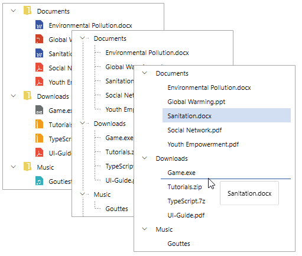

# WPF TreeView (SfTreeView) Overview

The Syncfusion [WPF TreeView](https://www.syncfusion.com/wpf-controls/treeview) is a data-oriented control that displays data in a hierarchical structure with expanding and collapsing nodes. It is commonly used to illustrate a folder structure, or nested relationships in an application.

## Key features

* Enhanced performance: Optimized view reuse strategy and flat rendering architecture for enhanced performance.
* Bound and unbound modes: Support to bind hierarchical data or add unbound tree nodes.
* On demand loading: Support to load the nodes on demand when the end user expands the node.
* Selection: Support to select the nodes with different selection modes and keyboard navigation.
* Drag and drop: Support to reorder the nodes by dragging and dropping them.
* Templating: Provides complete UI customization using the template and template selectors.
* Root lines: Support to show the lines between tree nodes.

N> You can also explore our [WPF TreeView example](https://github.com/syncfusion/wpf-demos) to knows how to represents hierarchical data in a tree-like structure with expand and collapse node options.