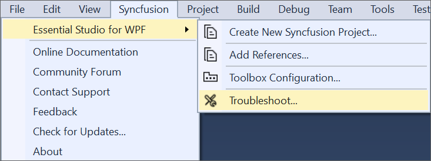
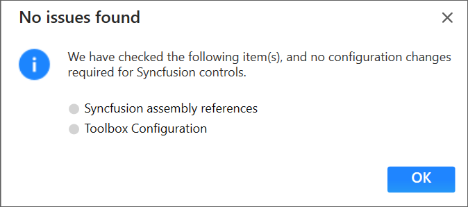
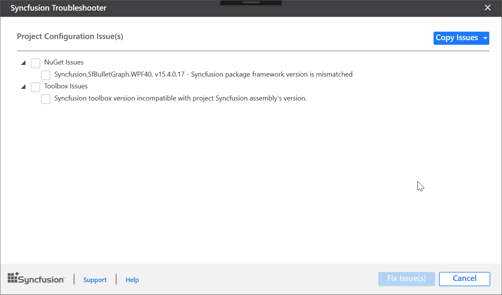

# Troubleshoot the project

Troubleshoot the project with the Syncfusion configuration and apply the fix, such as wrong.NET Framework version of a Syncfusion assembly to the project or missing any Syncfusion dependent assembly of a referred assembly. The Syncfusion Troubleshooter can perform the following tasks:

* Report the Configuration issues.  
* Apply the solution

## Report the Configuration issues

The steps below will assist you in using the Syncfusion Troubleshooter by Visual Studio. 

> Check whether the **WPF Extensions - Syncfusion** are installed or not in Visual Studio Extension Manager by going to **Tools -> Extensions and Updates -> Installed** for Visual Studio 2017 or lower, and **Extensions -> Manage Extensions -> Installed** for Visual Studio 2019 by going to Extensions -> Manage Extensions -> Installed. If this extension not installed, please install the extension by follow the steps from the [download and installation](download-and-installation) help topic.

1. To open Syncfusion Troubleshooter Wizard, follow either one of the options below: 
   
   **Option 1**  
   Open an existing Syncfusion WPF Application, Click **Syncfusion Menu** and choose **Essential Studio for WPF > Troubleshoot…** in Visual Studio.

   

   N> From Visual Studio 2019, Syncfusion menu is available under Extensions in Visual Studio menu.

   

   **Option 2**  
   **Right-click the Project file in Solution Explorer**, then select the command **Syncfusion Troubleshooter…**

   

2. Analyze the project now, and if any Syncfusion controls project configuration errors are discovered, they will be reported in the Troubleshooter dialog.  If there are no configuration issues with the project, the dialog box will indicate that no modifications are required in the following areas:

* Syncfusion assembly references.
* Syncfusion NuGet Packages. 
* Syncfusion Toolbox Configuration.

   

I> The Syncfusion Troubleshooter options will be visible only for Syncfusion projects which means the project should contain Syncfusion assemblies or Syncfusion NuGet packages referred.

The Syncfusion Troubleshooter handles the following project configuration issues: 

1. Assembly Reference Issues.

2. NuGet related Issues.

3. Toolbox Configuration Issues.

### Assembly Reference Issues

The Syncfusion Troubleshooter handles the assembly reference issues listed below in Syncfusion Projects. 

1. Dependent assemblies are missing for referred assemblies from project. 

   **For Instance:**  : If “Syncfusion.Chart.WPF” assembly referred in project and “Syncfusion.Shared.WPF” (dependent of Syncfusion.Chart.Base) not referred in project, the Syncfusion Troubleshooter will show dependent assembly missing.

   

2. Syncfusion Troubleshooter compare all Syncfusion assembly’s versions in the same project. If found any Syncfusion assembly version inconsistency, the Syncfusion Troubleshooter will show Syncfusion assemblies version mismatched. 

   **For Instance:**  If “Syncfusion.Tools.WPF” assembly (v17.1450.0.32) referred in project, but other Syncfusion assemblies referred assembly version is v17.1450.0.38. The Syncfusion Troubleshooter will show Syncfusion assembly version mismatched.

   

3. Framework version mismatching (Syncfusion Assemblies) with project’s .NET Framework version. Find the supported .NET Framework details for Syncfusion assemblies in the following link,

   <https://help.syncfusion.com/common/essential-studio/assembly-information#supported-framework-version-for-essential-studio-assemblies> 

   **For Instance:** The.NET Framework of the application is v4.5 and “Syncfusion.Tools.WPF” assembly (v17.1460.0.38 & .NET Framework version 4.6) referred in same application. The Syncfusion Troubleshooter will show Syncfusion assembly .NET Framework version is incompatible with project’s .NET Framework version.

   

   

### NuGet Issues

The Syncfusion Troubleshooter addressed following NuGet package related issues in Syncfusion projects. 

1. If the application has Syncfusion NuGet packages in multiple versions, then Syncfusion Troubleshooter will show  Syncfusion  NuGet package version is mismatched. 

   **For Instance:** Syncfusion WPF platform packages installed multiple version (v16.4.0.54 & v17.1.0.38), Syncfusion Troubleshooter will be shown Syncfusion package version mismatched.
 
   

2. Installed Syncfusion NuGet package’s Framework version is differing from the project’s .NET Framework version.

   **For Instance:** If “Syncfusion.SfBulletGraph.WPF40” NuGet package version(v15.4.0.17 with 4.0 Framework) installed in project, But the project .NET Framework version is 4.5. So, the Syncfusion Troubleshooter will show Syncfusion package Framework version is mismatched.
  
   

3. Dependent NuGet package of the installed Syncfusion NuGet packages is missing.

   **For Instance:** If install Syncfusion.Chart.WPF NuGet package alone in project, Syncfusion Troubleshooter will show the Syncfusion.Chart.Base and other dependent NuGet package missing.
 
   

I> Internet connection is required to restore the missing dependent packages. If internet is not available, the dependent packages will not be restored.

### Toolbox Configuration Issues

In Syncfusion projects, the Syncfusion Troubleshooter addresses the following Toolbox Configuration issues.

1. If the project .NET Framework version’s Syncfusion Toolbox is not installed/configured, the Syncfusion Troubleshooter will show Syncfusion Toolbox .NET Framework version is mismatched. 

   **For Instance:** If latest Syncfusion assembly reference version is v17.1.0.38 but Toolbox assemblies configured v17.1.0.32, the Syncfusion Troubleshooter will show Syncfusion Toolbox version mismatched.
 
   

2. If the configured version of Syncfusion Toolbox differs from the latest Syncfusion assembly reference version or NuGet package version in the same project, the Syncfusion Troubleshooter will indicate that the Syncfusion Toolbox version is mismatched.

   **For Instance:** If latest Syncfusion assembly reference version is v17.1.0.38 but Toolbox assemblies configured v17.1.0.32, the Syncfusion Troubleshooter will show Syncfusion Toolbox version mismatched.
  
   

## Apply the solution

1. After loading the Syncfusion Troubleshooter dialog, check the corresponding check box of the issue to be resolved. Then click the “Fix Issue(s)” button. 

   

2. A dialog appears, which will ask to take a backup of the project before performing the troubleshooting process. If you need to backup the project before troubleshooting, click “Yes” button. 

   

3. Wait for a while, the Syncfusion Troubleshooter is resolving the selected issues. After the troubleshooting process completed, there will be a status message in the Visual Studio status bar as “Troubleshooting process completed successfully”.

   

4. Then, Syncfusion licensing registration required message box will be shown if you installed the trial setup or NuGet packages since Syncfusion introduced the licensing system from 2018 Volume 2 (v16.2.0.41) Essential Studio release. Navigate to the [help topic](https://help.syncfusion.com/common/essential-studio/licensing/license-key#how-to-generate-syncfusion-license-key), which is shown in the licensing message box to generate and register the Syncfusion license key to your project. Refer to this [blog](https://blog.syncfusion.com/post/Whats-New-in-2018-Volume-2-Licensing-Changes-in-the-1620x-Version-of-Essential-Studio.aspx) post for understanding the licensing changes introduced in Essential Studio.   

   